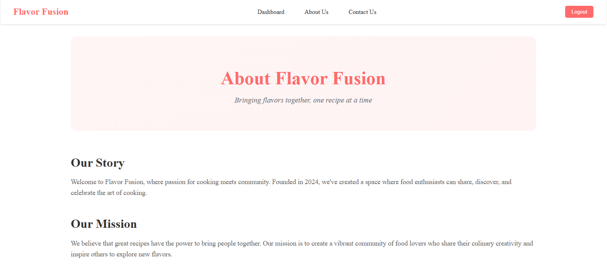
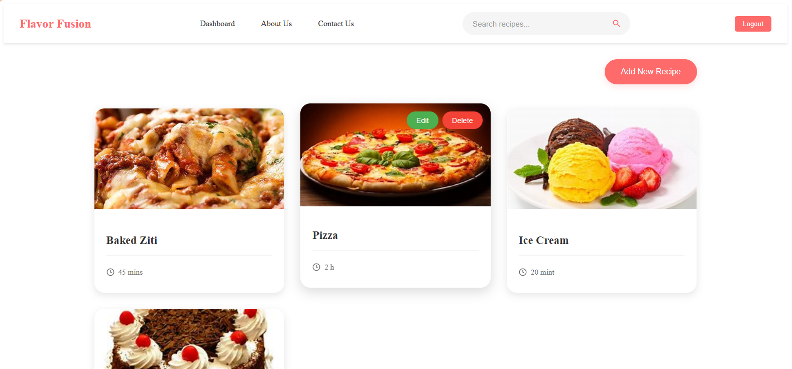
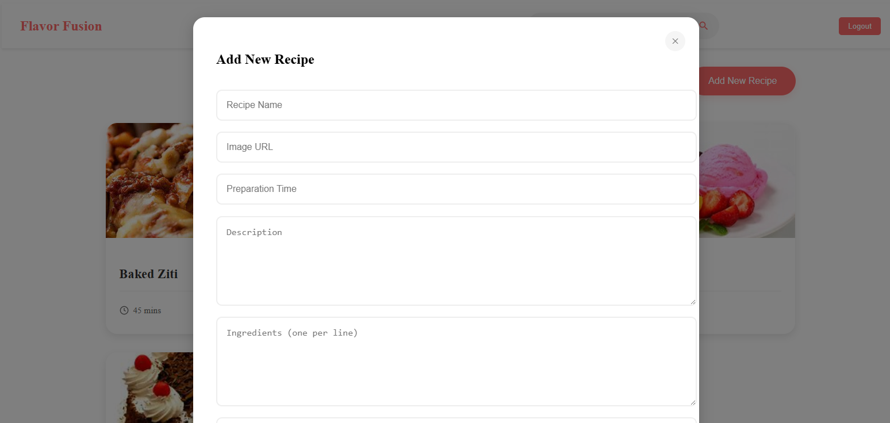
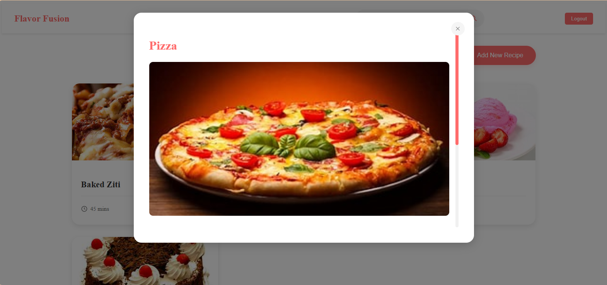
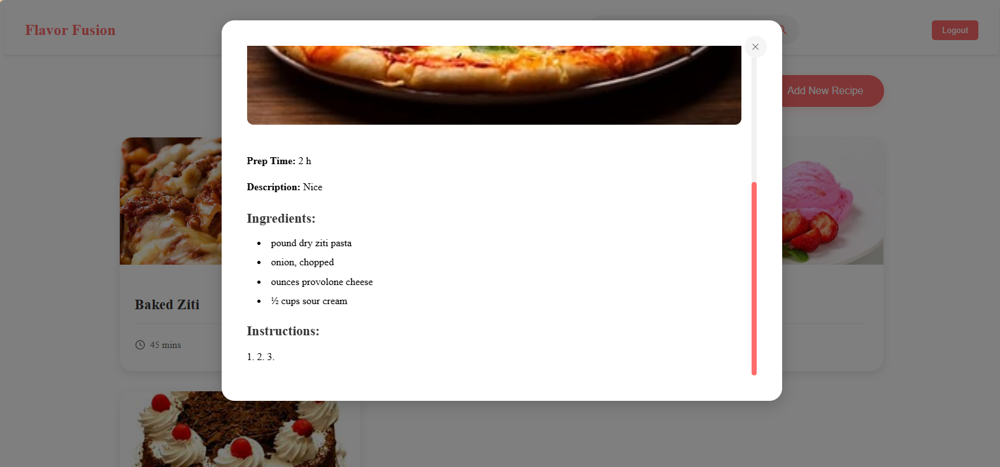
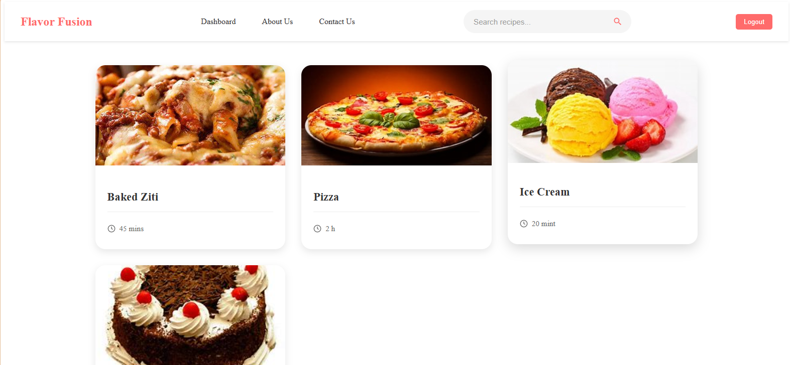

      <h1>  Flavor Fusion</h1>
      <h3>A Modern Recipe Sharing Platform</h3>

    

# 📌 Overview

Flavor Fusion is a dynamic recipe sharing platform that brings food enthusiasts together. Built with modern web technologies, this platform allows users to discover, share, and manage recipes while providing administrators with powerful content management capabilities.

# 🛠️ Tech Stack

## 🚀 Live Demo

- Access the live demo here: [Flavor Fusion](https://jamalihassan0307.github.io/Flavour-Fusion/)

## 📸 Screenshots

### About Page & Landing

  
  
<em>Our mission and story</em>

### Admin Interface

  
  
  
<em>Comprehensive recipe management for administrators</em>

### Recipe Details

  
  
  
<em>Detailed recipe views with ingredients and instructions</em>

### User Experience

  
  
<em>User-friendly recipe browsing interface</em>

### Contact Features

  
  
  
<em>Get in touch with our team</em>

## Demo Credentials

### Admin Account

- Email: admin@gmail.com
- Password: 1234

### Demo User Account

- Email: user@gmail.com
- Password: 1234

## 🚀 Key Features

### User Management

- Role-based authentication system
- Secure login functionality
- User-specific recipe viewing

### Recipe Management (Admin)

- Add new recipes
- Edit existing recipes
- Delete recipes
- Manage recipe details and images

### Recipe Features

- Browse recipe collection
- View detailed recipe information
- Search functionality
- Preparation time tracking
- Ingredient lists
- Step-by-step instructions

### Additional Features

- Responsive design
- User-friendly interface
- Form validation
- Secure authentication
- Recipe image support

## Project Structure

## 🙏 Acknowledgments

- [HTML5](https://developer.mozilla.org/en-US/docs/Web/HTML)
- [CSS3](https://developer.mozilla.org/en-US/docs/Web/CSS)
- [JavaScript](https://developer.mozilla.org/en-US/docs/Web/JavaScript)
